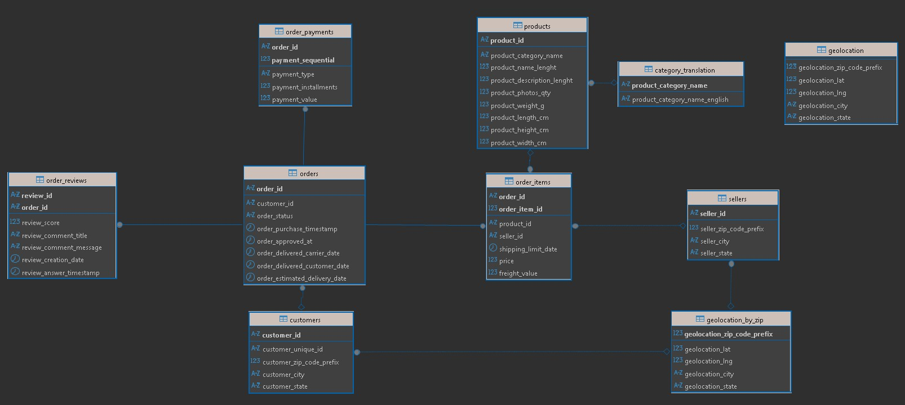
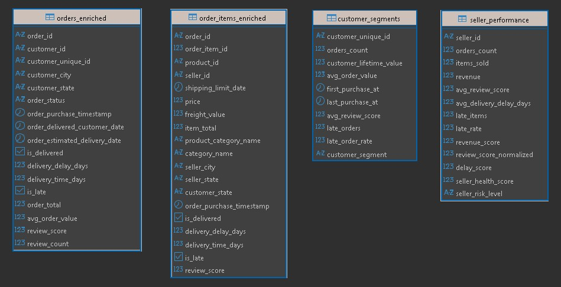
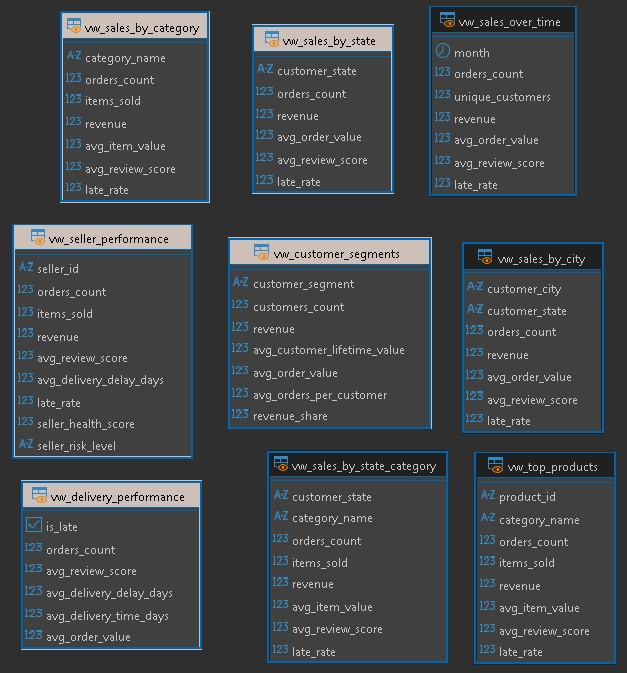

# Olist Analytics — Consulting Case: Data + Analytics + IA

Dashboard analítico com agente de IA sobre o dataset público de e-commerce brasileiro da Olist.

---

## Índice

1. [Dataset](#dataset)
2. [Arquitetura](#arquitetura)
3. [Modelo de dados](#modelo-de-dados)
4. [Estrutura do repositório](#estrutura-do-repositório)
5. [Executando localmente](#executando-localmente)
6. [Executando com Docker (cloud ou servidor)](#executando-com-docker-cloud-ou-servidor)
7. [A persona de IA](#a-persona-de-ia)
8. [Exemplos de perguntas](#exemplos-de-perguntas)

---

## Dataset

**Brazilian E-Commerce Public Dataset by Olist**
[https://www.kaggle.com/datasets/olistbr/brazilian-ecommerce](https://www.kaggle.com/datasets/olistbr/brazilian-ecommerce)

100 mil pedidos reais entre 2016–2018: clientes, pedidos, itens, pagamentos, avaliações, produtos e vendedores.

### Como baixar

**Opção 1 — Kaggle CLI**

```bash
pip install kaggle
# Coloque kaggle.json em ~/.kaggle/ (Windows: C:\Users\<user>\.kaggle\)
kaggle datasets download -d olistbr/brazilian-ecommerce --unzip -p data/
```

**Opção 2 — Download manual**

1. Acesse o link acima e clique em **Download**
2. Extraia o zip em `data/` na raiz do projeto

A pasta `data/` deve conter os seguintes arquivos:

```
data/
├── olist_customers_dataset.csv
├── olist_orders_dataset.csv
├── olist_order_items_dataset.csv
├── olist_order_payments_dataset.csv
├── olist_order_reviews_dataset.csv
├── olist_products_dataset.csv
├── olist_sellers_dataset.csv
└── product_category_name_translation.csv
```

### Relacionamento entre os arquivos do dataset


---

## Arquitetura

```
Kaggle CSV
    │
    ▼
┌─────────────────────────────────────────────────────────┐
│  ETL (Python)                                           │
│  etl/extract.py → etl/transform.py → etl/load.py       │
│  + etl/views.py  (views analíticas)                     │
└────────────────────────┬────────────────────────────────┘
                         │
                         ▼
              ┌──────────────────┐
              │  PostgreSQL 16   │  (Docker)
              │  schema: analytics│
              └────────┬─────────┘
                       │
          ┌────────────┴─────────────┐
          │                          │
          ▼                          ▼
  ┌──────────────┐         ┌──────────────────────┐
  │  Dashboard   │         │  AI Business Analyst  │
  │  Streamlit   │◄───────►│  Gemini 2.5 Flash     │
  │  (app.py)    │         │  Function Calling      │
  └──────────────┘         └──────────────────────┘
```

**Fluxo de dados:**
- O ETL carrega e transforma os CSVs, calculando métricas derivadas e segmentações
- O PostgreSQL persiste 4 tabelas enriquecidas e 9 views analíticas
- O dashboard consome as views diretamente via SQLAlchemy
- O agente de IA chama ferramentas Python que executam queries parametrizadas nas views — nunca SQL livre

---

## Modelo de dados

### Tabelas brutas (pós-carga dos CSVs)

Tabelas carregadas no PostgreSQL com limpeza mínima, antes das transformações analíticas.



### Tabelas analíticas enriquecidas (pós-ETL)

As 4 tabelas geradas pelo ETL com métricas derivadas, segmentações e scores calculados.



### Views analíticas (consumidas pelo dashboard e pela IA)

As 9 views pré-agregadas que servem tanto o dashboard Streamlit quanto as ferramentas do agente de IA.



---

## Estrutura do repositório

```
.
├── app.py                  # Ponto de entrada do Streamlit
├── docker-compose.yml      # PostgreSQL + Streamlit em container
├── entrypoint.sh           # Roda ETL e inicia Streamlit (container)
├── requirements.txt
├── .env.example
│
├── data/                   # CSVs do Kaggle (não versionado)
│
├── etl/
│   ├── config.py           # Configurações e conexão
│   ├── extract.py          # Leitura dos CSVs
│   ├── transform.py        # Limpeza, métricas e segmentações
│   ├── load.py             # Carga no PostgreSQL via COPY
│   ├── views.py            # Criação das views analíticas
│   └── pipeline.py         # Orquestração do ETL
│
├── sql/
│   └── views.sql           # DDL das 9 views analíticas
│
└── src/
    ├── db.py               # Queries do dashboard + cache Streamlit
    ├── charts.py           # Gráficos Plotly
    ├── utils.py            # Formatação e agregações
    ├── ai_agent.py         # Agente Gemini (function calling loop)
    ├── ai_tools.py         # 10 ferramentas que consultam as views
    └── prompt.txt          # System instruction da persona
```

---

## Executando localmente

### Pré-requisitos

- Python 3.10+
- Docker Desktop
- Chave de API do Gemini: [https://aistudio.google.com/apikey](https://aistudio.google.com/apikey) (gratuito)

### Passo a passo

**1. Clone o repositório e entre na pasta**

```bash
git clone <url-do-repo>
cd Consulting_Case
```

**2. Baixe o dataset** (veja seção [Dataset](#dataset)) e coloque os CSVs em `data/`

**3. Configure o ambiente**

```bash
# Windows (PowerShell)
Copy-Item .env.example .env

# Linux / macOS
cp .env.example .env
```

Abra o `.env` e preencha sua chave Gemini:

```env
POSTGRES_HOST=localhost
POSTGRES_PORT=5432
POSTGRES_DB=olist
POSTGRES_USER=olist
POSTGRES_PASSWORD=olist
POSTGRES_SCHEMA=analytics
DATA_DIR=./data
GEMINI_API_KEY=sua_chave_aqui
```

**4. Suba o PostgreSQL**

```bash
docker compose up -d postgres
```

Aguarde até o container estar healthy:

```bash
docker compose ps   # Status deve ser "healthy"
```

**5. Crie e ative o ambiente Python**

```bash
# Windows
python -m venv .venv
.\.venv\Scripts\Activate.ps1

# Linux / macOS
python -m venv .venv
source .venv/bin/activate
```

```bash
pip install -r requirements.txt
```

**6. Execute o ETL**

```bash
python -m etl.pipeline
```

O ETL carrega os CSVs, transforma os dados e cria as views. Leva ~1–2 minutos.

**7. Inicie o dashboard**

```bash
streamlit run app.py
```

Abra [http://localhost:8501](http://localhost:8501).

---

## Executando com Docker (cloud ou servidor)

Abra o `.env` novamente e atualize as chaves:

```env
POSTGRES_HOST=postgres # mude para o host do container PostgreSQL
POSTGRES_PORT=5432
POSTGRES_DB=olist
POSTGRES_USER=olist
POSTGRES_PASSWORD=olist
POSTGRES_SCHEMA=analytics
DATA_DIR=/app/data # mude para o caminho do dataset no container
GEMINI_API_KEY=sua_chave_aqui
```

Essa opção sobe tudo em containers: PostgreSQL + ETL + Streamlit. Testado e deployado em AWS EC2.

### Pré-requisitos

- Docker e Docker Compose instalados na máquina
- Dataset baixado localmente na pasta `data/`

### Passo a passo

**1. Configure o `.env`**

```bash
cp .env.example .env
```

Edite e preencha `GEMINI_API_KEY`. O `DATA_DIR` já está configurado para `/app/data` (caminho interno do container).

**2. Suba tudo com um comando**

```bash
docker compose up -d --build
```

O `entrypoint.sh` do container `streamlit` executa automaticamente:
1. `python -m etl.pipeline` (ETL completo)
2. `streamlit run app.py` (inicia o dashboard)

Acompanhe os logs:

```bash
docker compose logs -f streamlit
```

Quando aparecer `You can now view your Streamlit app`, acesse:

- **Local:** [http://localhost:8501](http://localhost:8501)
- **AWS EC2:** `http://18.191.2.160/:8501`

> Certifique-se de que a porta `8501` está liberada no Security Group da instância EC2.

**3. Para atualizar os dados**

```bash
# Substitua os CSVs em data/ e reexecute:
docker compose restart streamlit
```

### Parar os containers

```bash
docker compose down          # mantém o volume do banco
docker compose down -v       # remove também os dados do banco
```

---

## A persona de IA

**Página:** AI Business Analyst (terceira aba do dashboard)

**Persona:** Analista sênior de e-commerce brasileiro. Nunca responde com conhecimento genérico — toda resposta exige chamada a uma ferramenta de dados antes de ser gerada.

**Modelo:** Gemini 2.5 Flash (Google AI Studio)

**Abordagem:** Function Calling com loop automático. O agente decide quais ferramentas chamar, executa-as contra o banco e só então escreve a resposta.

### Ferramentas disponíveis

| Ferramenta | O que retorna |
|---|---|
| `get_business_overview` | Snapshot executivo: receita total, pedidos, top categoria/estado, taxa de atraso, vendedores em risco, share VIP |
| `get_sales_by_category` | Métricas por categoria: receita, pedidos, nota média, taxa de atraso |
| `get_sales_by_state` | Métricas por estado (UF): receita, ticket médio, nota média |
| `get_sales_by_city` | Métricas por cidade, com filtro opcional por estado |
| `get_sales_by_state_category` | Cruzamento estado × categoria |
| `get_sales_over_time` | Receita, pedidos e clientes por mês (até 24 meses) |
| `get_customer_segments` | Segmentos VIP / High Value / Regular / Low Value com LTV e share de receita |
| `get_seller_performance` | Health score, risco e métricas operacionais por vendedor |
| `get_delivery_performance` | Pedidos no prazo vs atrasados: nota média, tempo médio, ticket |
| `get_top_products` | Top produtos por receita, com filtro opcional por categoria |

### Regras da persona (system prompt)

1. **Sempre chama ao menos uma ferramenta** antes de escrever a resposta
2. **Cita números exatos** vindos dos dados (receita, %, contagens)
3. **Sugere ação concreta** baseada na evidência
4. **Se não há dados suficientes**, responde: *"Com os dados disponíveis, não é possível concluir isso."*
5. **Responde no idioma da pergunta** (PT ou EN)

### Formato de resposta

```
### Evidências
- (bullet com número exato do dado)

### Análise
(1–2 frases conectando evidência ao insight de negócio)

### Recomendação
(1 ação concreta e priorizada)
```

---

## Exemplos de perguntas

**"Dê um panorama geral do negócio."**
> Chama `get_business_overview` → retorna receita total, top categoria, top estado, taxa de atraso global, vendedores em risco e share do segmento VIP.

**"Quais categorias têm maior potencial de crescimento?"**
> Chama `get_sales_by_category` ordenado por receita, depois por `avg_review_score` para cruzar volume com satisfação.

**"Qual é a relação entre atraso de entrega e nota do cliente?"**
> Chama `get_delivery_performance` → compara nota média de pedidos no prazo vs atrasados com números exatos.

**"Quantos vendedores estão em situação de risco?"**
> Chama `get_seller_performance(risk_level="At Risk")` → retorna contagem e health scores.

**"Quais categorias dominam em SP?"**
> Chama `get_sales_by_state_category(state="SP")` → retorna ranking de categorias dentro do estado.